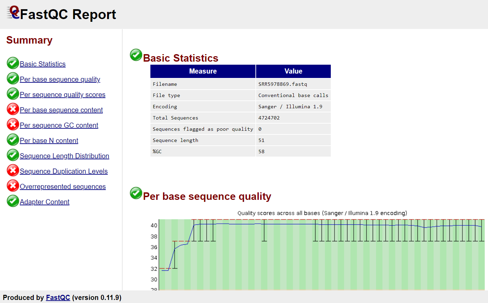

# Assessing Quality with FastQC

The first step of m6A-seq analysis is to assess the quality of the sequence reads in FASTQ files from the sequencing facility. [FastQC](http://www.bioinformatics.babraham.ac.uk/projects/fastqc/) is a quality control application for high-throughput sequencing data. By using FastQC, we could be aware of any problems in raw sequence data before moving on to the next analysis. 

## Install FastQC

FastQC requires a suitable 64-bit Java Runtime Environment (JRE) installed and in the path. To check the version of Java:

```shell
java -version
```

For linux, install FastQC from [project website](http://www.bioinformatics.babraham.ac.uk/projects/download.html#fastqc) and follow the [instruction of setup](https://raw.githubusercontent.com/s-andrews/FastQC/master/INSTALL.txt):

```shell
wget http://www.bioinformatics.babraham.ac.uk/projects/fastqc/fastqc_v0.11.9.zip
unzip fastqc_v0.11.9.zip
```

Verify installation:

```shell
cd /home/user/fastqc
./fastqc -help
```

## Execute FastQC

Examine the quality of one FastQ file:

```shell
cd /home/user/fastqc
./fastqc -o /home/User/fastqcResult/ /home/User/fastqFiles/SRR5179431.fastq
```

or examine the quality of multiple FastQ files:

```shell
cd /home/user/fastqc
./fastqc -o /home/User/fastqcResult/ -t 6 /home/User/fastqFiles/*.fastq
```

**Note**: `-o` (or `--outdir`) will create all output files in the specified output directory. `-t` specifies the number of files / threads that can be processed in parallel.

## FastQC Results

FastQC produces two outputs: an HTML report and a packed file.

### 1. HTML report

Transfer the HTML file to local place by *FileZilla* (mac) or *WinSCP* (win), and open the file in browser.



**Note 1**: two of the most important analysis modules in FastQC are **“Per base sequence quality”** plot and the **“Overrepresented sequences”** table. The “Per base sequence quality” plot provides the distribution of quality scores across all bases at each position in the reads. The “Overrepresented sequences” table displays the sequences (at least 20 bp) that occur in more than 0.1% of the total number of sequences, which aids in identifying contamination. 

**Note 2**: You can refer to [Analysis Modules](http://www.bioinformatics.babraham.ac.uk/projects/fastqc/Help/3%20Analysis%20Modules/) in FastQC documentation for the interpretation of the HTML report. 

### 2. Zip file

Unpack a .zip file in result directory:

```shell
unzip SRR5179431_fastqc.zip
```

or unpack .zip files in result directory:

```shell
for zip in *.zip
do
unzip $zip
done
```

To see the content of a single summary file:

```shell
cat SRR5179431_fastqc/summary.txt
```

or cat all summary files into one text file and have a look at it:

```shell
cat */summary.txt > ~/all/fastqc_summaries.txt
cat ~/all/fastqc_summaries.txt
```

# Reference

Documentation of FastQC on Babraham Bioinformatics website: http://www.bioinformatics.babraham.ac.uk/projects/fastqc/Help/


