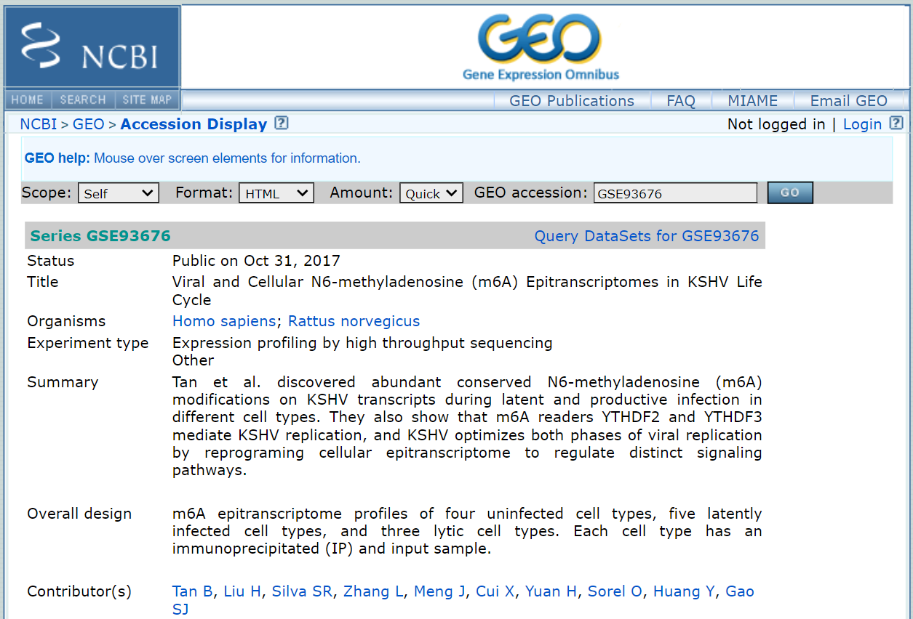

# Obtaining GEO data Using SRA Toolkit

The Sequence Read Archive (SRA) is a publically accessible archive for high throughput sequencing data. The [SRA Toolkit](https://ncbi.github.io/sra-tools/) from NCBI is a collection of tools for using data in the INSDC SRA. It takes the following steps to download data from SRA:


## Install and Config SRA Toolkit

For Ubuntu

```shell
# Download and extract the latest version
$ wget --output-document sratoolkit.tar.gz https://ftp-trace.ncbi.nlm.nih.gov/sra/sdk/2.10.9/sratoolkit.2.10.9-ubuntu64.tar.gz
$ tar -vxzf sratoolkit.2.10.9-ubuntu64.tar.gz

# Append the path to your PATH environment variable:
$ export PATH=$PATH:/path/to/sratoolkit.2.10.9-ubuntu64/bin

# Verify the installation
$ which fastq-dump
```


## Download Data from SRA

1. Access the GEO summary page by searching "GSE93676" on [GEO website](https://www.ncbi.nlm.nih.gov/geo/).



2. Find a link for "SRA" under the heading "Relations".


3. Click on the link (SRP096845) which sends you to a page of all the biological samples with specific runs and files in this study.


4. To find files of interest in one comprehensive list, navigate to the bottom of the page then click: "send to" > "Run Selector" > "go". Use "Filter List" to narrow down the choices. 


5. Extract FastQ files from SRA-accession using SRA-Toolkit

```shell
$ prefetch SRR5978869
$ fastq-dump SRR5978869
```


# Reference

SRA-tools wiki on Github: https://github.com/ncbi/sra-tools/wiki

