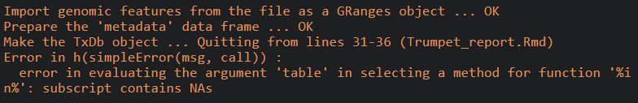
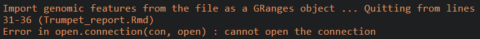

# Post-alignment Quality Assessment with Trumpet

The [trumpet](https://github.com/skyhorsetomoon/Trumpet) R package is a valuable tool for assessing the quality of m6A-seq data. It takes the aligned BAM files of m6A-seq data together with the transcriptome annotation as the inputs, and returns an assessment report concerning the data quality.


```R
if (!requireNamespace("devtools", quietly = TRUE))
    install.packages("devtools")
devtools::install_github("skyhorsetomoon/Trumpet")
library(Trumpet)

root = "/path/to/homo"
setwd(root)
GENE_ANNO_GTF = file.path(root,"GRCh37_RefSeq_24.gff") # transcript annotation

f1 = file.path(root, "SRR5978834_trimmed_s.bam")
f2 = file.path(root, "SRR5978835_trimmed_s.bam")
f3 = file.path(root, "SRR5978836_trimmed_s.bam")
IP_BAM = c(f1,f2,f3) 

f1 = file.path(root, "SRR5978827_trimmed_s.bam")
f2 = file.path(root, "SRR5978828_trimmed_s.bam")
f3 = file.path(root, "SRR5978829_trimmed_s.bam")
INPUT_BAM = c(f1,f2,f3)

f1 = file.path(root, "SRR5179446_trimmed_s.bam")
f2 = file.path(root, "SRR5179447_trimmed_s.bam")
f3 = file.path(root, "SRR5179448_trimmed_s.bam")
TREATED_INPUT_BAM = c(f1,f2,f3)

f1 = file.path(root, "SRR5978869_trimmed_s.bam")
f2 = file.path(root, "SRR5978870_trimmed_s.bam")
f3 = file.path(root, "SRR5978871_trimmed_s.bam")
TREATED_IP_BAM = c(f1,f2,f3)

trumpet_report <- Trumpet_report(IP_BAM = IP_BAM,
                                 Input_BAM = INPUT_BAM,
                                 contrast_IP_BAM = TREATED_IP_BAM,
                                 contrast_Input_BAM = TREATED_INPUT_BAM,
                                 condition1 = "untreated", condition2 = "treat", 
                                 GENE_ANNO_GTF = GENE_ANNO_GTF)
browseURL("Trumpet_report.html")
```


> Issue: cannot get results for errors.

BAM aligned to hg19:


BAM aligned to hhv8:



BAM aligned to mm10:




# Reference

[1] T. Zhang, S.-W. Zhang, L. Zhang, and J. Meng, "trumpet: transcriptome-guided quality assessment of m6A-seq data," BMC Bioinformatics, vol. 19, no. 1, p. 260, 2018/07/13 2018, doi: 10.1186/s12859-018-2266-3. [[paper](https://bmcbioinformatics.biomedcentral.com/articles/10.1186/s12859-018-2266-3)]