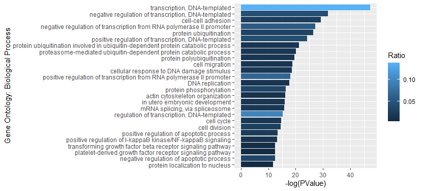

# DAVID

## Prepare and Upload Gene Lists 

From the output file ("Mod.csv") generated from exomePeak2, we remove duplicated values in "geneID" column and copy all the unique IDs to a txt file ("geneID.txt"). 

Upload txt files to DAVID website with Identifier as "ENTREZ_GENE_ID", species as "Homo sapiens", and "Gene List" selected. Submit all lists and wait for results.

## Analyze Results

Open "Functional Annotation Chart" and click on "Download File" to download the txt file containing results. 

Import txt file into R, analyze results and display in figures.

