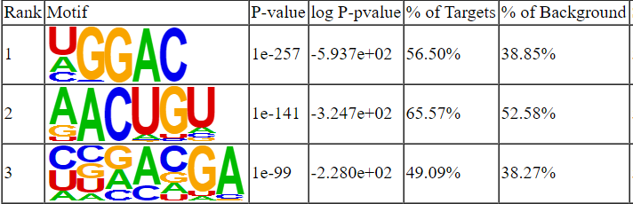
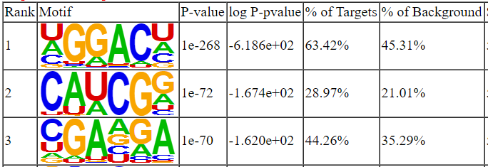

# Homer

Homer is a software for motif discovery and next-gen sequencing analysis. We are going to use this tool to find m6A motifs within peaks that has been found.

## Convert BED to FASTA

### 1. Install bedtools

```shell
# Download and config
$ wget https://github.com/arq5x/bedtools2/releases/download/v2.30.0/bedtools-2.30.0.tar.gz
$ tar -zxvf bedtools-2.30.0.tar.gz
$ cd bedtools2
$ make
$ export PATH=$PATH:/path/to/bedtools2/bin

# Verify installation
$ bedtools --version
```

### 2. Convert BED to FASTA

```shell
$ bedtools getfasta -s -fi /path/to/genome.fa -bed /path/to/Mod.bed -split -fo mod.fa
```

The "mod.bed" file is generated from exomePeak2 package, and the "geneme.fa" is the whole genome of hg19 which has been downloaded previously.


## Install Homer

```shell
# Download and install following the instruction: http://homer.ucsd.edu/homer/introduction/install.html
$ mkdir homer
$ cd homer
$ wget http://homer.ucsd.edu/homer/configureHomer.pl
$ perl configureHomer.pl -install

# Append to PATH environment variable
$ export PATH=$PATH:/path/to/homer/.//bin/

# Verify installation
$ findMotifs.pl
```


## Find Motifs

```shell
$ findMotifs.pl mod.fa fasta /path/to/MotifOutput -rna -p 10 -len 5,6
```

The motifs enriched in peaks on hg19 transcripts.



The motifs enriched in peaks on mm10 transcripts.




# Reference

[1] Duttke SH, Chang MW, Heinz S, Benner C. Identification and dynamic quantification of regulatory elements using total RNA. Genome Res. 2019 Nov;29(11):1836-1846. doi: 10.1101/gr.253492.119. Epub 2019 Oct 24. PMID: 31649059; PMCID: PMC6836739. [[paper](https://genome.cshlp.org/content/early/2019/10/24/gr.253492.119.abstract)]