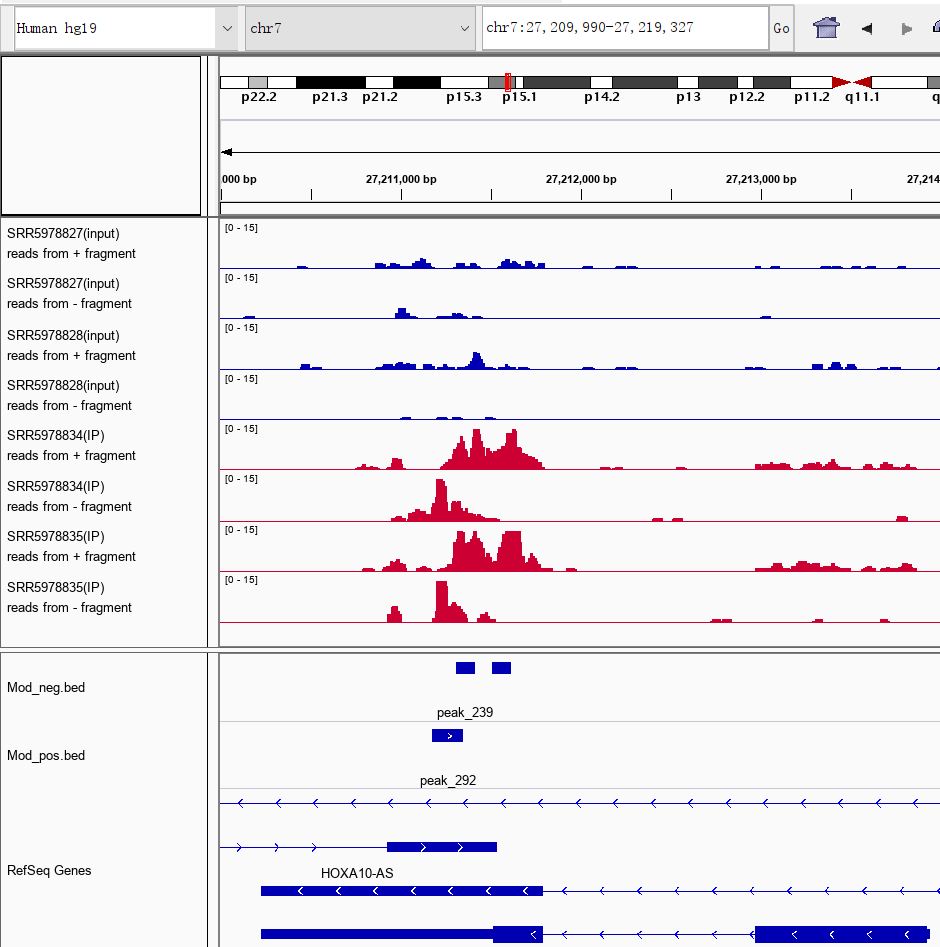

## Visualization of Reads (IGV)

The Integrative Genomics Viewer (IGV) is a high-performance viewer that efficiently handles large heterogeneous data sets [13]. We are going to use this tool to visualize aligned reads on genome and the differential methylated sites.


### Visualization of Aligned Reads

Upload BAM and its index (.bai) file to [IGV web application](https://igv.org/app/) and zoom in to see the aligned reads.


### Visualization of Methylation Sites

#### 1. Install IGV

```shell
# Java of version 11 is required. 
$ java -version

# Download and install from http://software.broadinstitute.org/software/igv/download
$ wget https://data.broadinstitute.org/igv/projects/downloads/2.9/IGV_2.9.2.zip
$ unzip IGV_2.9.2.zip
$ cd IGV_2.9.2
$ nohup bash igv.sh

# Verify installation
$ igvtools version
```

#### 2. Generate TDF

```bash
#!/bin/bash
Data="/path/to/homo_result"
Output="/path/to/homo_igv"

for s in SRR5978827 SRR5978828 SRR5978829 SRR5978834 SRR5978835 SRR5978836 SRR5978869 SRR5978870 SRR5978871 SRR5179446 SRR5179447 SRR5179448
do 
igvtools count --strands read -z 5 -w 10 -e 0 $Data/${s}_sorted.bam $Output/${s}.tdf homo_genome.fa
wait
done
```

```shell
#!/bin/bash
Data="/path/to/mm10_result"
Output="/path/to/mm10_igv"

for s in SRR866997 SRR866998 SRR866999 SRR867000 SRR867001 SRR867002 SRR866991 SRR866992 SRR866993 SRR866994 SRR866995 SRR866996
do 
igvtools count --strands read -z 5 -w 10 -e 0 $Data/${s}_sorted.bam $Output/${s}.tdf mm10_genome.fa
wait
done
```


#### 3. Run IGV

The generated TDF files and BED file can then be visualized using IGV browser. As clearly shown in the figure below zooming in a region of an antisense gene , the exomePeak2 has the ability to distinguish methylation sites on specific strands.




