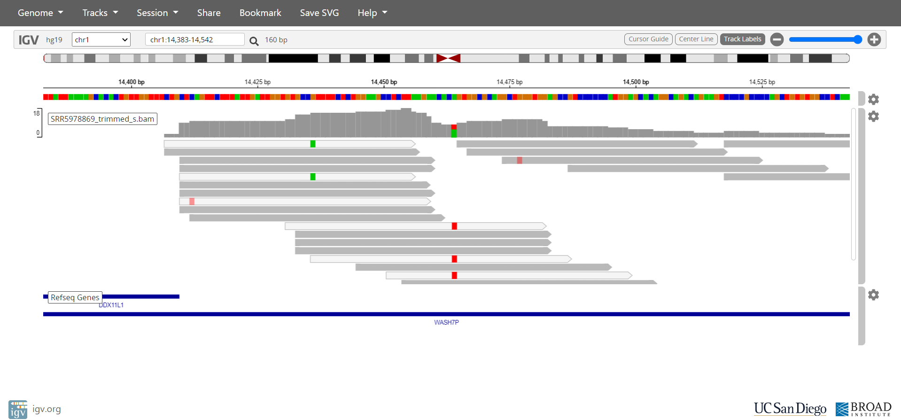

# Integrative Genomics Viewer (IGV)

The Integrative Genomics Viewer (IGV) is a high-performance viewer that efficiently handles large heterogeneous data sets [1].


## Visualization of Aligned Reads

Upload BAM and its index (.bai) file to [IGV web application](https://igv.org/app/).




## Visualization of Methylation Sites

### 1. Install IGV

```shell
# Java of version 11 is required. 
$ java -version

# Download and install from http://software.broadinstitute.org/software/igv/download
$ wget https://data.broadinstitute.org/igv/projects/downloads/2.9/IGV_2.9.2.zip
$ unzip IGV_2.9.2.zip
$ cd IGV_2.9.2
$ nohup bash igv.sh

# Verify installation
$ igvtools version
```


### 2. Generate TDF

```shell
# Generate TDF
$ igvtools count -z 5 -w 10 -e 0 SRR5978869_trimmed_s.bam SRR5978869.tdf genome.fa
```


### 3. Run IGV

The generated TDF files and BED file can then be visualized using IGV browser.


# Reference

[1] H. Thorvaldsdóttir, J. T. Robinson, and J. P. Mesirov, "Integrative Genomics Viewer (IGV): high-performance genomics data visualization and exploration," (in eng), Brief Bioinform, vol. 14, no. 2, pp. 178-92, Mar 2013, doi: 10.1093/bib/bbs017. [[paper](https://pubmed.ncbi.nlm.nih.gov/22517427/)]