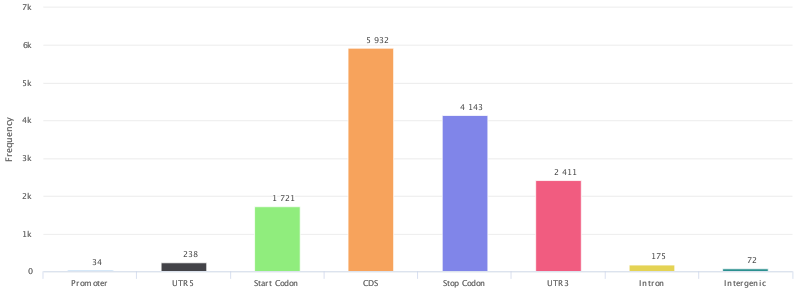
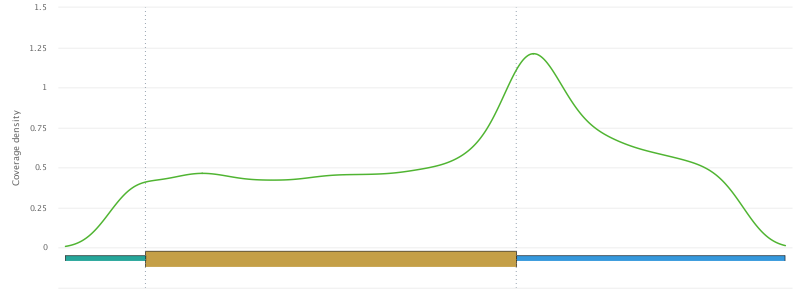
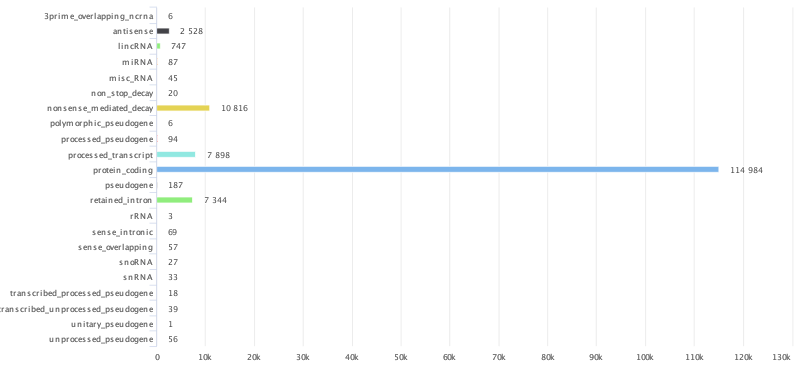
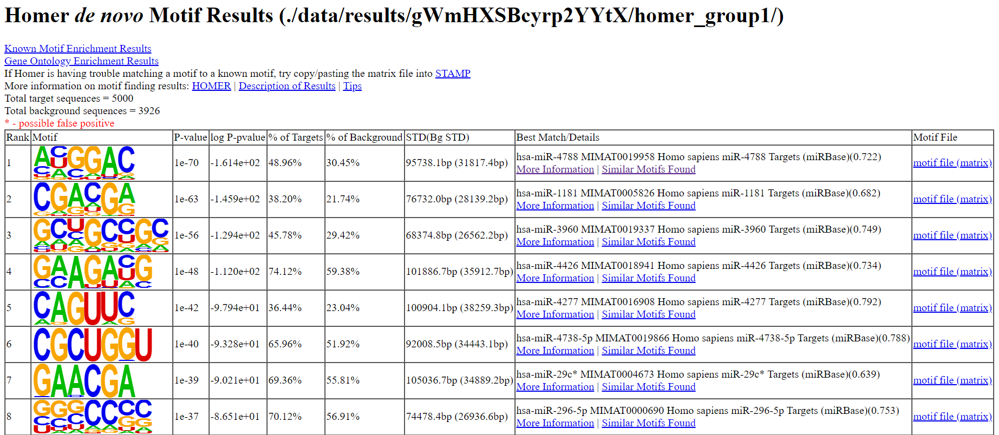

# RNAmod

[RNAmod](http://61.147.117.195/RNAmod/) is a convenient web-based platform for the meta-analysis and functional annotation of modifications on mRNAs [1].

To obtain modification site information, click on "Single case" in the [Home page](http://bioinformatics.sc.cn/RNAmod/index.php), upload the BED file generated from exomePeak2 package, and submit the job. Then you will receive a job ID and will use it to query the job status and get the results in the [result page](http://bioinformatics.sc.cn/RNAmod/results.php). You can either view the results on browser or download the zip file to the local place. 

Some of the figures about modification site information are displayed below:

*  Peaks gene features distribution:

* mRNA metagene plot

* Gene types distribution

* Enriched motifs

# Reference

[1] Q. Liu and R. I. Gregory, "RNAmod: an integrated system for the annotation of mRNA modifications," Nucleic Acids Res, vol. 47, no. W1, pp. W548-W555, 2019, doi: 10.1093/nar/gkz479. [[paper](https://academic.oup.com/nar/article/47/W1/W548/5506862)]