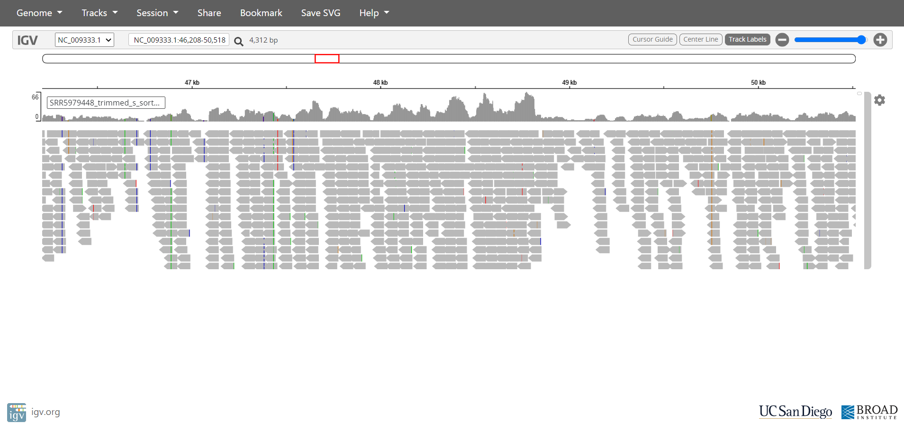
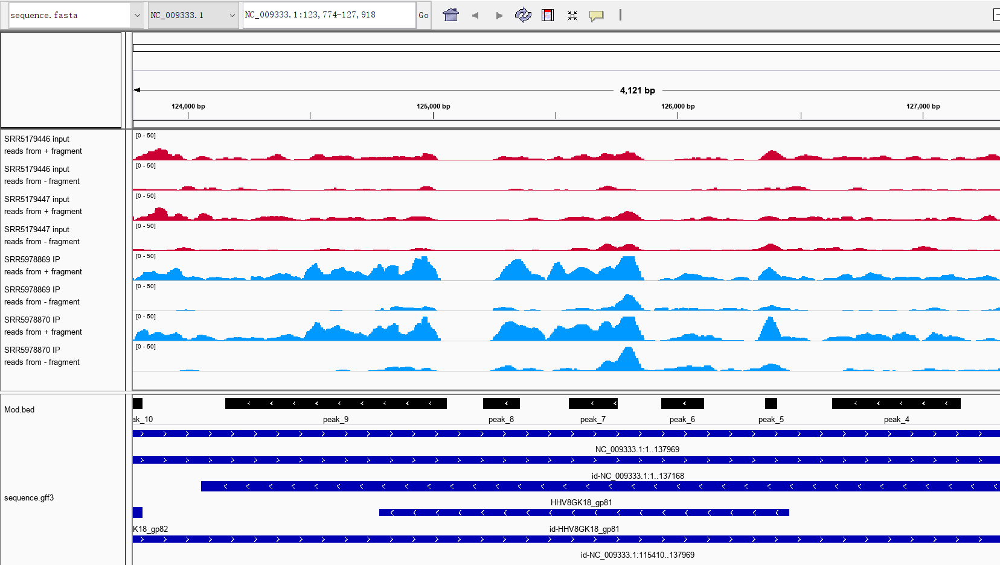

## Visualization of Reads (IGV)


### Visualization of Aligned Reads

Upload the following files to [IGV web application](https://igv.org/app/).

* HHV8 virus genome (.fa) and its index (.fai) to "Genome".
* BAM and its index (.bai) file to "Track".




### Visualization of Methylation Sites


#### 1. Generate TDF

```shell
#!/bin/bash
Data="/path/to/hhv8_result"
Output="/path/to/hhv8_igv"

for s in SRR5978827 SRR5978828 SRR5978829 SRR5978834 SRR5978835 SRR5978836 SRR5978869 SRR5978870 SRR5978871 SRR5179446 SRR5179447 SRR5179448
do 
igvtools count -z 5 -w 10 -e 0 $Data/${s}_sorted.bam $Output/${s}.tdf hhv8_genome.fa
wait
done
```


#### 2. Run IGV

The generated TDF files and BED file can then be visualized using IGV browser.



