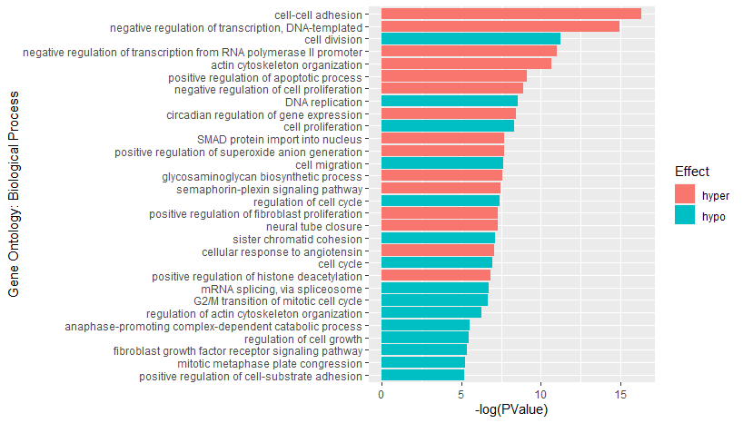
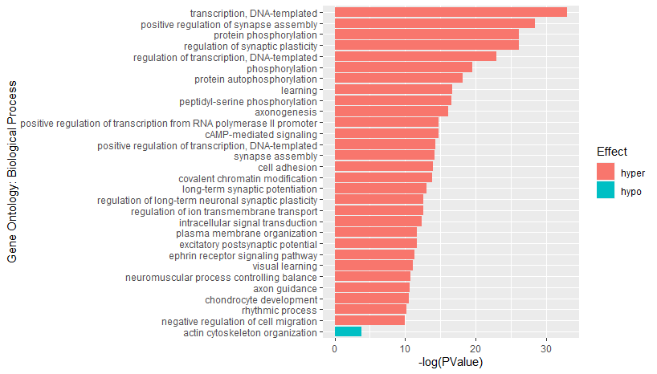

# DAVID

The **D**atabase for **A**nnotation, **V**isualization and **I**ntegrated **D**iscovery (**DAVID**) is a website providing a comprehensive set of functional annotation tools for investigators to understand biological meaning behind large list of genes [1]. We are going to use this tool to discover enriched gene functions.


## Prepare and Upload Gene Lists 

From the output file ("DiffMod.csv") generated from exomePeak2, we remove duplicated values in "geneID" column and copy all the unique IDs to a txt file ("geneID_diff.txt"). 

Upload txt files to DAVID website with Identifier as "ENTREZ_GENE_ID", species as "Homo sapiens", and "Gene List" selected. Submit all lists and wait for results.


## Analyze Results

Open "Functional Annotation Chart" and click on "Download File" to download the txt file containing results. 


Import txt file into R, analyze results and display in figures.

```R
library(readr)
library(dplyr)
chart = read_tsv("chart_diff.txt")

# generate a figure for differential expressed genes
generateFigure = function(chart, num, term = "GOTERM_BP_DIRECT"){

  p = selectPvalue(chart)
  frame = as.data.frame(chart %>%
    filter(Category == term) %>%
    select(c("Term", "%", "PValue")) %>%
    rename("Ratio"=`%`) %>%
    mutate(Term = as.factor(gsub("^.*?~", "",Term)), 
           Ratio = Ratio / 100))[1:30,] # make sure no less than 30 terms in total
  
  fig2 = frame %>%
    ggplot(aes(x=reorder(Term, -PValue),y=-log(PValue),fill = Ratio)) +
    geom_bar(stat="identity") +
    coord_flip() + 
    xlab("Gene Ontology: Biological Process") 
    
  return(fig2)
}

generateFigure(chart, 30, term)


# generate a figure for hyper/hypo genes
chartp = read_tsv("pos_david_mm.txt")
chartn = read_tsv("neg_david_mm.txt")
chartp = chartp %>% mutate(Effect = "hyper")
chartn = chartn %>% mutate(Effect = "hypo")
charts = rbind(chartp, chartn)

generateFigure_hyper_hypo = function(charts, term = "GOTERM_BP_DIRECT"){
  
  print(charts %>%
          filter(Category == term & Effect == 'hyper') %>%
          select(c("Term", "%", "PValue", "Effect")) %>%
          rename("Ratio"=`%`) %>%
          mutate(Term = as.factor(gsub("^.*?~", "",Term)), 
                 Ratio = Ratio / 100) %>% nrow())
  
  frame_p = as.data.frame(charts %>%
    filter(Category == term & Effect == 'hyper') %>%
    select(c("Term", "%", "PValue", "Effect")) %>%
    rename("Ratio"=`%`) %>%
    mutate(Term = as.factor(gsub("^.*?~", "",Term)), 
           Ratio = Ratio / 100))[1:29,]
  
  print(charts %>%
          filter(Category == term & Effect == 'hypo') %>%
          select(c("Term", "%", "PValue", "Effect")) %>%
          rename("Ratio"=`%`) %>%
          mutate(Term = as.factor(gsub("^.*?~", "",Term)), 
                 Ratio = Ratio / 100) %>% nrow())
  
  frame_n = as.data.frame(charts %>%
     filter(Category == term & Effect == 'hypo') %>%
     select(c("Term", "%", "PValue", "Effect")) %>%
     rename("Ratio"=`%`) %>%
     mutate(Term = as.factor(gsub("^.*?~", "",Term)), 
            Ratio = Ratio / 100))[1,]
  
  frame = rbind(frame_p,frame_n)
  
  fig2 = frame %>%
    ggplot(aes(x=reorder(Term, -PValue),y=-log(PValue),fill = Effect)) +
    geom_bar(stat="identity") +
    coord_flip() + 
    xlab("Gene Ontology: Biological Process")
  
  return(fig2)
}

generateFigure_hyper_hypo(charts)
```

Enriched biological processes regulated by differential expressed genes on hg19 genome.



Enriched biological processes regulated by differential expressed genes on mm10 genome.



# Reference

[1] X. Jiao, B. T. Sherman, D. W. Huang, R. Stephens, M. W. Baseler, H. C. Lane et al., "DAVID-WS: a stateful web service to facilitate gene/protein list analysis," (in eng), Bioinformatics (Oxford, England), vol. 28, no. 13, pp. 1805-1806, 2012, doi: 10.1093/bioinformatics/bts251.[[paper](https://www.ncbi.nlm.nih.gov/pmc/articles/PMC3381967/?report=abstract)]