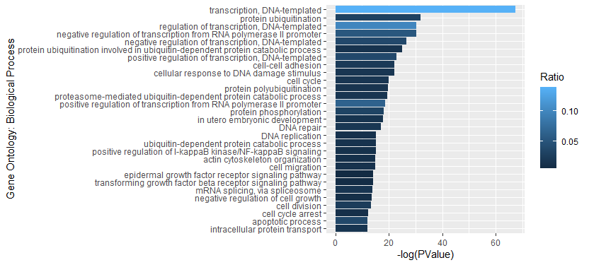

# DAVID


## Prepare and Upload Gene Lists 

From the output file ("DiffMod.csv") generated from exomePeak2, we remove duplicated values in "geneID" column and copy all the unique IDs to a txt file ("geneID_diff.txt"). 

Upload txt files to DAVID website with Identifier as "ENTREZ_GENE_ID", species as "Homo sapiens", and "Gene List" selected. Submit all lists and wait for results.


## Analyze Results

Open "Functional Annotation Chart" and click on "Download File" to download the txt file containing results. 


Import txt file into R, analyze results and display in figures.

```R
library(readr)
library(dplyr)
chart = read_tsv("chart_diff.txt")

generateFigure = function(chart, num, term = "GOTERM_BP_DIRECT"){

  p = selectPvalue(chart)
  frame = as.data.frame(chart %>%
    filter(Category == term) %>%
    select(c("Term", "%", "PValue")) %>%
    rename("Ratio"=`%`) %>%
    mutate(Term = as.factor(gsub("^.*?~", "",Term)), 
           Ratio = Ratio / 100))[1:30,] # make sure no less than 30 terms in total
  
  fig2 = frame %>%
    ggplot(aes(x=reorder(Term, -PValue),y=-log(PValue),fill = Ratio)) +
    geom_bar(stat="identity") +
    coord_flip() + 
    xlab("Gene Ontology: Biological Process") 
    
  return(fig2)
}

generateFigure(chart, 30, term)
```




