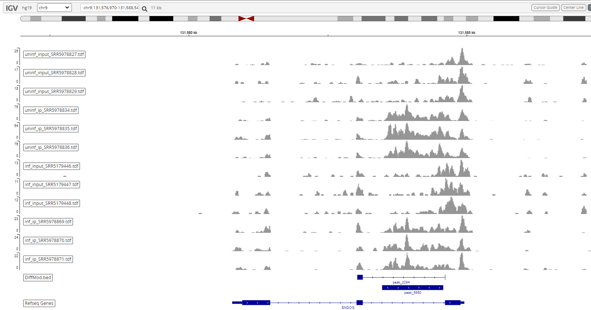

# Integrative Genomics Viewer (IGV)

## Visualization of Methylation Sites

The generated TDF files and BED file can be visualized using IGV browser.

# Reference

[1] H. Thorvaldsdóttir, J. T. Robinson, and J. P. Mesirov, "Integrative Genomics Viewer (IGV): high-performance genomics data visualization and exploration," (in eng), Brief Bioinform, vol. 14, no. 2, pp. 178-92, Mar 2013, doi: 10.1093/bib/bbs017. [[paper](https://pubmed.ncbi.nlm.nih.gov/22517427/)]