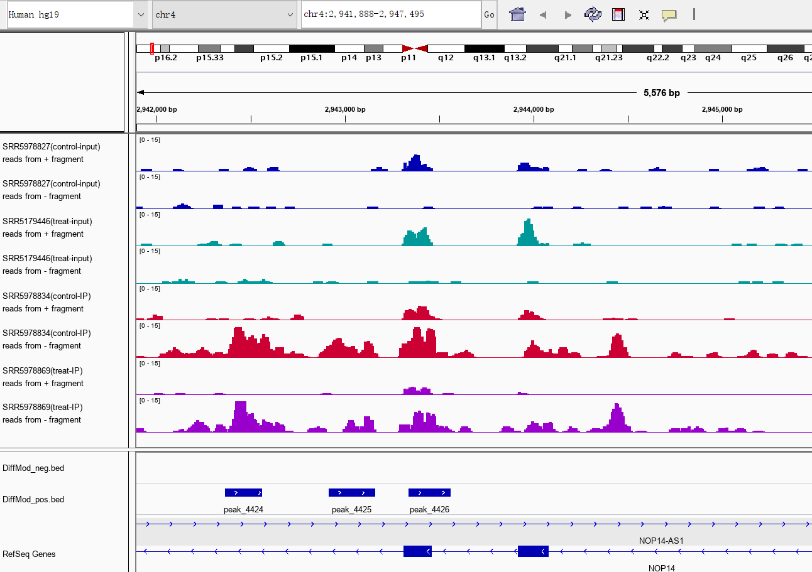

## Visualization of Reads (IGV)

Here we use the IGV tool to visualize reads and peaks comparing control and experimental groups. This task can be simply done by uploading the generated TDF files and BED file onto the IGV browser.

