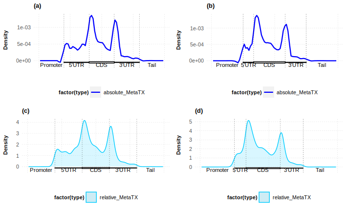

# MetaTX


> **Issue:**
>
> Fail to install the package from Github using devtools.
>
> Repo address: https://github.com/yue-wang-biomath/MetaTX.1.0


## Visualization of the Distribution of Peaks

```R
# Load libraries
library(MetaTX)
library(rtracklayer)

# Import BED file from exomePeak2
gr_obj =  import("DiffMod.bed")
end(ranges(gr_obj)) <- start(ranges(gr_obj))

# Download information about mRNA components
txdb <- TxDb.Hsapiens.UCSC.hg19.knownGene
cds_by_tx0_1 <- cdsBy(txdb, "tx")
fiveUTR_tx0_1 <- fiveUTRsByTranscript(txdb,use.names=FALSE)
threeUTR_tx0_1 <- threeUTRsByTranscript(txdb,use.names=FALSE)

# Map peaks to the RNA model
remap_results_m6A_1 <- remapCoord(features = gr_obj, txdb = txdb, num_bin = 10, includeNeighborDNA = TRUE, cds_by_tx0 = cds_by_tx0_1, fiveUTR_tx0 = fiveUTR_tx0_1,
threeUTR_tx0 = threeUTR_tx0_1) 

# Plots
p1 <-  metaTXplot(remap_results_m6A_1,
                  num_bin              = 10,
                  includeNeighborDNA   = TRUE,
                  relativeProportion   = c(1, 1, 1, 1),
                  title  = '(a)',
                  legend = 'absolute',
                  type = 'absolute'
)

p2 <-  metaTXplot(remap_results_m6A_1,
                  num_bin              = 10,
                  includeNeighborDNA   = TRUE,
                  relativeProportion   = c(1, 3, 2, 3),
                  title  = '(b)',
                  legend = 'absolute',
                  type = 'absolute'
)

p3 <-  metaTXplot(remap_results_m6A_1,
                  num_bin              = 10,
                  includeNeighborDNA   = TRUE,
                  relativeProportion   = c(1, 1, 1, 1),
                  title  = '(c)',
                  legend = 'relative',
                  type = 'relative'
)

p4 <-  metaTXplot(remap_results_m6A_1,
                  num_bin              = 10,
                  includeNeighborDNA   = TRUE,
                  relativeProportion   = c(1, 3, 2, 3),
                  title  = '(d)',
                  legend = 'relative',
                  type = 'relative'
)

ggdraw() +
  draw_plot(p1, 0, .5, .5, .5) +
  draw_plot(p2, .5, .5, .5, .5) +
  draw_plot(p3, 0, 0, .5, .5) +     
  draw_plot(p4, .5, 0, .5, .5)

```


