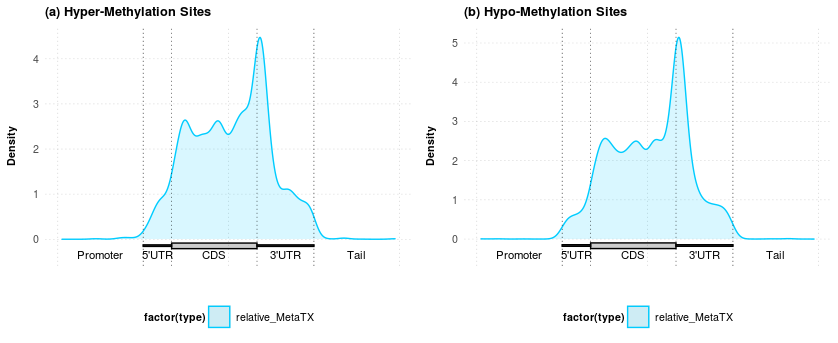

## Distribution of m6A sites (MetaTX)

We are going to use MetaTX to visualize the distribution of methylation sites.

### Visualization of the Distribution of Peaks

The following code produces separate figures of the distribution of hyper-methylation sites and hypo-methylation sites.

```R
# Load libraries
library(MetaTX)
library(rtracklayer)
library(readr)
library(bedr)
library(genomation)
library(GenomicRanges)

# Import BED file from exomePeak2
file <- "exomePeak2_output_diff_1strand/DiffMod.bed"
gr_obj =  import(file)

# Separate by hyper and hypo methylation sites
data1 <- data[strand(gr_obj) == "+",]
data2 <- data[strand(gr_obj) == "-",]
df1 <- data.frame(seqnames=seqnames(data1),
                  starts=start(data1),
                  ends=end(data1),
                  names=elementMetadata(data1)$name,
                  scores=elementMetadata(data1)$score,
                  strands=strand(data1))
df2 <- data.frame(seqnames=seqnames(data2),
                  starts=start(data2),
                  ends=end(data2),
                  names=elementMetadata(data2)$name,
                  scores=elementMetadata(data2)$score,
                  strands=strand(data2))
write.table(df1, file="Mod_metaTX_diff_pos.bed", quote=F, sep="\t", row.names=F, col.names=F)
write.table(df2, file="Mod_metaTX_diff_neg.bed", quote=F, sep="\t", row.names=F, col.names=F)

# Import separated bed files
file_pos <- "Mod_metaTX_diff_pos.bed"
file_neg <- "Mod_metaTX_diff_neg.bed"
gr_obj_pos <- import(file_pos)
gr_obj_neg <- import(file_neg)
gr_obj_pos <- resize(gr_obj_pos, width = 1, fix = "center")
gr_obj_neg <- resize(gr_obj_neg, width = 1, fix = "center")

# Download information about mRNA components
txdb <- TxDb.Hsapiens.UCSC.hg19.knownGene
cds_by_tx0_1 <- cdsBy(txdb, "tx")
fiveUTR_tx0_1 <- fiveUTRsByTranscript(txdb,use.names=FALSE)
threeUTR_tx0_1 <- threeUTRsByTranscript(txdb,use.names=FALSE)

# Map peaks to the RNA model
remap_results_m6A_1 <- remapCoord(features = gr_obj_pos, txdb = txdb, num_bin = 10, includeNeighborDNA = TRUE, cds_by_tx0 = cds_by_tx0_1, fiveUTR_tx0 = fiveUTR_tx0_1,
                                  threeUTR_tx0 = threeUTR_tx0_1) 
# Plot 1
p1 <-  metaTXplot(remap_results_m6A_1,
                  num_bin              = 10,
                  includeNeighborDNA   = TRUE,
                  relativeProportion   = c(1, 3, 2, 3),
                  title  = '(a) Hyper-Methylation Sites',
                  legend = 'relative',
                  type = 'relative'
)

# Map peaks to the RNA model
remap_results_m6A_2 <- remapCoord(features = gr_obj_neg, txdb = txdb, num_bin = 10, includeNeighborDNA = TRUE, cds_by_tx0 = cds_by_tx0_1, fiveUTR_tx0 = fiveUTR_tx0_1,
                                  threeUTR_tx0 = threeUTR_tx0_1) 
# Plot 1
p2 <-  metaTXplot(remap_results_m6A_2,
                  num_bin              = 10,
                  includeNeighborDNA   = TRUE,
                  relativeProportion   = c(1, 3, 2, 3),
                  title  = '(b) Hypo-Methylation Sites',
                  legend = 'relative',
                  type = 'relative'
)

# Plot all
ggdraw() +
  draw_plot(p1, 0, 0, .5, 1) +
  draw_plot(p2, .5, 0, .5, 1)
```




### Report Isoform Probabilities 

MetaTX also provides a function for returning the probabilities of a particular feature being located on different isoforms.

```R
isoform_probs <- isoformProb(remap_results_m6A_1, num_bin = 10, includeNeighborDNA = TRUE, lambda = 2)
write.csv(isoform_probs, "isoform_probs.csv")
```

Here are the first few rows of the outputs.


