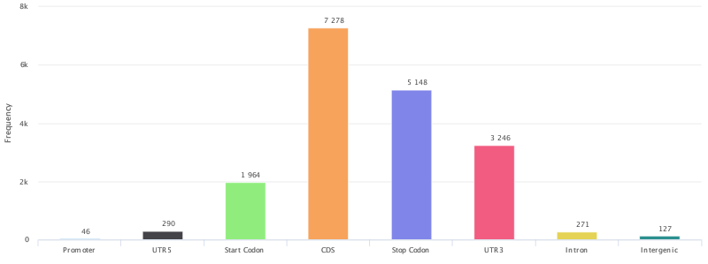
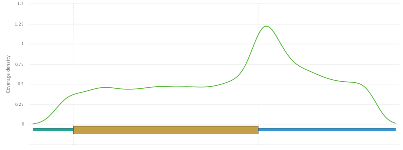
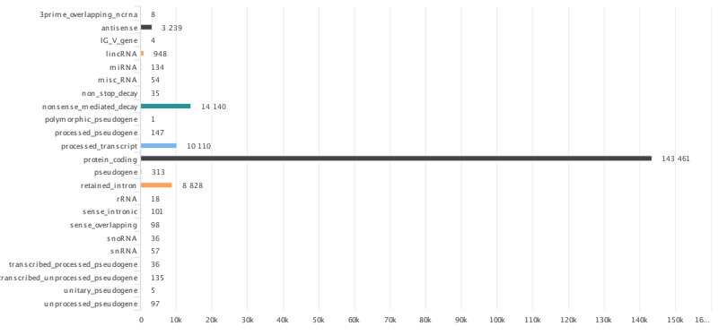

## RNA Annotation (RNAmod)

To obtain modification site information, click on "Single case" in the RNAmod [Home page](http://bioinformatics.sc.cn/RNAmod/index.php), upload the BED file generated from exomePeak2 package, and submit the job. Then you will receive a job ID and will use it to query the job status and get the results in the [result page](http://bioinformatics.sc.cn/RNAmod/results.php). You can either view the results on browser or download the zip file to the local place. 

Some of the figures about modification site information are displayed below:

*  Peaks gene features distribution:

* mRNA metagene plot

* Gene types distribution

