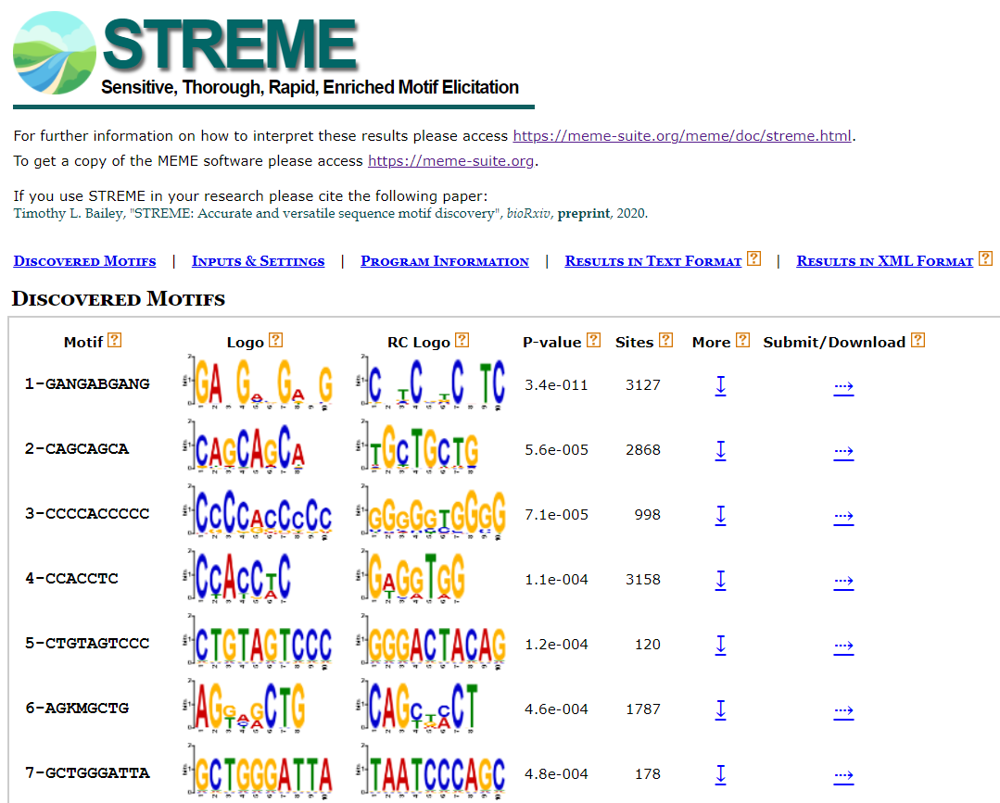

# STREME

[STREME](https://meme-suite.org/meme/doc/streme.html) can find motifs in large sequence datasets and report accurate significance estimates for each motif that it discovers [1]. Specifically, STREME works by discovering ungapped motifs that are enriched in the sequences or relatively enriched in them compared to the control sequences.


## Convert BED to FASTA

```shell
$ bedtools getfasta -s -fi /path/to/genome.fa -bed /path/to/DiffMod.bed -split -fo Diffmod.fa
```


## Motif Discovery

```shell
# Usage of command-line version: https://meme-suite.org/meme/doc/streme.html
$ streme --dna --objfun de --minw 5 --maxw 10 --o /path/to/streme_result --p DiffMod.fa
# not sure whether --objfun cd or --objfun de, the former requires equal length of peaks
```


## Outputs

```markdown
 - streme_result
 	- streme.html
 	- streme.txt
 	- streme.xml
```

Transfer the HTML file to local place by *FileZilla* (mac) or *WinSCP* (win), and open the file in browser. A screenshot of part of the HTML file is shown below.





# Reference

[1] T. L. Bailey, "STREME: Accurate and versatile sequence motif discovery," bioRxiv, p. 2020.11.23.394619, 2020, doi: 10.1101/2020.11.23.394619. [[paper](https://www.biorxiv.org/content/10.1101/2020.11.23.394619v1.full)]