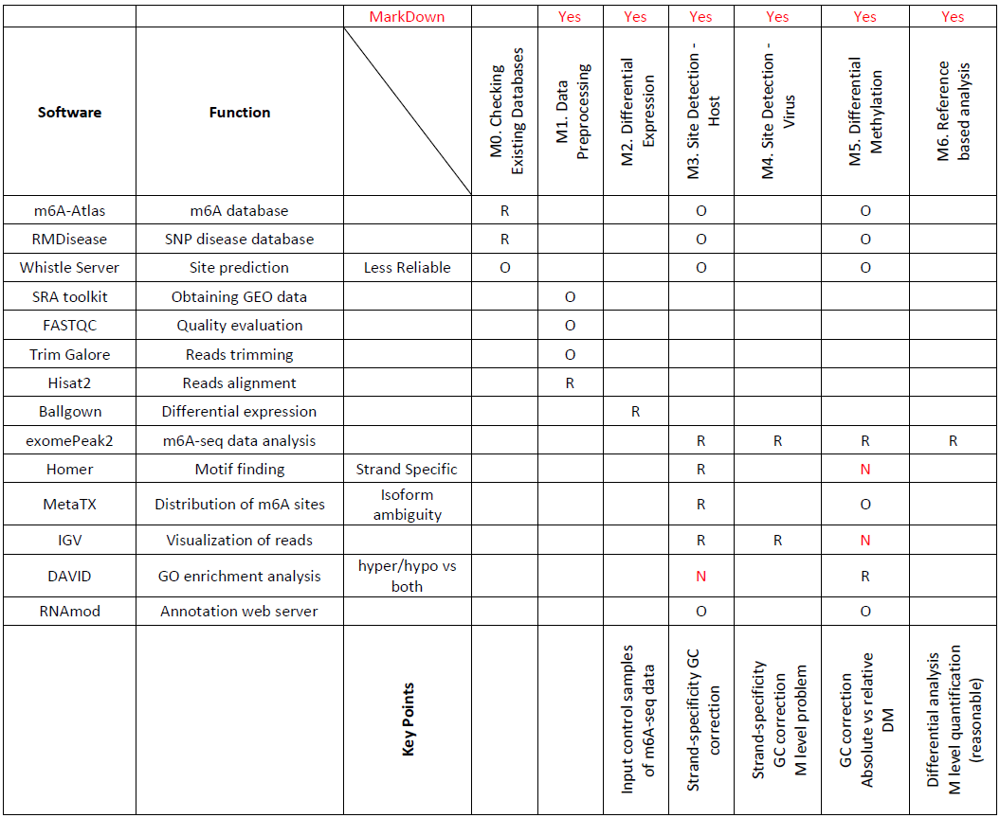

<h1 align="center">A Protocol for m6A-seq Data Analysis </h1>

This protocol serves as a step-by-step guide to m6A-seq data analysis. We include all the major steps involved in seven modules: **database checking, data preprocessing, differential expression analysis, site detection(host), site detection(virus),differential methylation analysis, and reference-based analysis**. We demonstrate the procedures by analyzing two published MeRIP-seq datasets from scratch based on UNIX shell and R system. The data information are summarized in the "Dataset" subsection. The software information and workflow are summarized in the following table.

